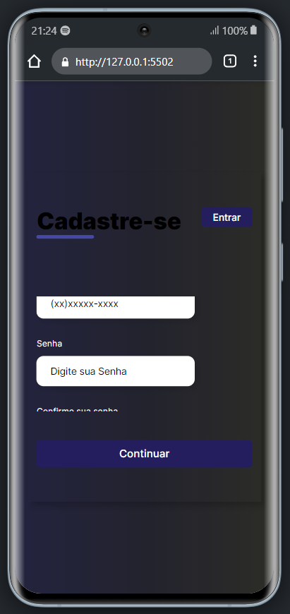

<h1>Formulário de cadastro de usuário</h1>

<strong>Este é um formulário de cadastro de usuário criado usando apenas HTML e CSS. Ele possui sete campos de entrada, incluindo:</strong>

<li>Nome completo</li>
<li>CPF</li>
<li>Data de nascimento</li>
<li>Endereço de e-mail</li>
<li>Número de celular</li>
<li>Senha</li>
<li>Confirmação de senha</li> 
<h2><li><strong>Tecnologia utilizada</strong></li></h2>

<h3>Este formulário foi criado usando apenas duas tecnologias:</h3>

<li>HTML</li>
<li>CSS</li> 

<h2><li><strong>Características</strong></li></h2>
<li>Totalmente responsivo</li>
<li>Interface amigável para o usuário</li>
<li>Design limpo e moderno</li>

 

<h2><strong>Veja abaixo a imagem do formulário em um desktop:</strong><h2>

